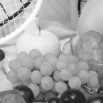
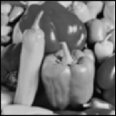
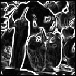
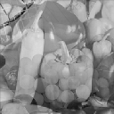
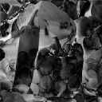

# FPGA Image Processing

Implementation of simple image processing operations in verilog. This project revolves around a central image processing module `image_processing.v` which can be included in a simulation environment using verilator or it can be included in a `top.v` for the ice40 Ultraplus fpga. Both case are implemented in the `simulation/` and `ice40/` folders.

As it is targeted to low end fpga devices (both in price and power consumption) such as the ice40 ultraplus. It uses 1Mbit of ram to store the images into
two buffers, the input and the storage buffer.
Images are loaded and read in the input buffer, the calculations are done on the storage buffer. The two buffers can be swapped. Most operations will be done in the storage buffer, if an operation is applied on the two images (for example binary_add), the resulting image will be written in the storage buffer.

The images are stored in a .h (done with gimp).

### Operations
- per pixel ops
   - add/sub
   - invert
   - threshold
   - mult/div
- 3x3 matrix convolution
   - apply convolution on storage buffer, writes result back
   - apply convolution on input buffer, adds result with storage buffer.
- binary operation (input *op* buffer)
   - add
   - sub
   - mult
- switch input and buffer
- load image to input
- read image from input

### Examples

<table>
    <thead>
        <tr>
            <th>Original</th>
            <th></th>
            <th></th>
        </tr>
    </thead>
    <tbody>
        <tr>
            <td>Add & threshold</td>
            <td></td>
            <td>"</td>
        </tr>
        <tr>
            <td>Multiplication 0.5x</td>
            <td></td>
            <td></td>
        </tr>
        <tr>
            <td>Gaussian blur</td>
            <td></td>
            <td></td>
        </tr>
        <tr>
            <td>Edge detection</td>
            <td></td>
            <td></td>
        </tr>
        <tr>
            <td>Average  
            0.5\*fruits+0.5\*peppers</td>
            <td colspan=2 align="center"></td>
        </tr>
        <tr>
            <td>Difference  
            abs(fruits-peppers)</td>
            <td colspan=2 align="center"></td>
        </tr>
    </tbody>
</table>

### Commands

The image processing module receives messages separated into blocks of 8bits values
a message is composed of a 1B operand and the parameters which can be of variable length (from 0 to n).

The commands are listed as an enum in `software/image_processing.h`

| Command name | Content | Description |
|-----|-----|-----|
|COMMAND_PARAM | byte0:width LSB<br>byte1:width MSB<br>byte2:height LSB<br>byte3:height MSB | This is the first command to be sent to the IP module, will do some init and sets the image size, sizes are given as unsigned 16bits numbers, in little endian |
|COMMAND_SEND_IMG | width*height bytes data | Sends the image to the module, image will be stored in input buffer |
|COMMAND_GET_STATUS | none | Returns some status on the module, 4 bytes will be returned of which only the bit0 of byte0 is useful (for now) which tells if module is busy or not |
|COMMAND_READ_IMG | none | Will receive the image data, which will be image_width*image_height bytes. The sizes are the ones given with the COMMAND_PARAM |
|COMMAND_APPLY_ADD | byte0: add value LSB<br>byte1: add value MSB<br> byte2: bit0: clamp | Ask the module to do an add, image+value, the value is a 16bits signed value, the last parameter is the clamp, if set to one, it will clamp the result between 0 and 255, and avoid cyclic overflow |
|COMMAND_APPLY_THRESHOLD | byte0: thresholding value<br>byte1: replacement value<br>byte2: bit0: upper selection of threshold | Will replace pixels in the resulting image if they satisfy the thresholding, if upper selection is 1, this means that every pixels >= to thresh_val will be set to replacement, otherwise it will replace every pixels <= thresh_val |
|COMMAND_SWITCH_BUFFERS | none | Images in input and storage buffers will be switched |
|COMMAND_BINARY_ADD | byte0: bit0: clamp | Adds input pixels with storage and store result in storage, clamp parameter will prevent values going over 255 or under 0 and be cyclic |
|COMMAND_APPLY_INVERT | none | Will invert image in storage buffer, inversion means that the new image will have pixels = 255 - storage_pixels |
|COMMAND_CONVOLUTION | byte0: bit0 clamp bit1: source input bit2: add to result<br> bytes 1 to 9: 3x3 convolution matrix byte as a 8bit fixed point value, in row major format (first 3 bytes are for first row) | Will do a convolution of the image with the 3x3 matrix. The border pixels will not be evaluated (set at 0). Format of the kernel matrix is in 8bit fixed point: 1bit sign, 3bits integers, 4bits fractions.<br> The convolution will normally be applied on the image in storage buffer and the result will be written in the same buffer. However the convolution can be applied on the input buffer by setting the source_input bit. By setting the add_to_result bit, the convolution result will be added to the content of the storage buffer instead of overwriting it, this is useful for edge detection (multiple kernels on different gradients orientation) |
|COMMAND_BINARY_SUB | byte0: bit0: clamp, bit1 is absolute difference | Will do image input - image storage and store the result in storage. If bit1 is active, will do the absolute difference between input and storage |
|COMMAND_BINARY_MULT | byte0: bit0: clamp | Will do input*storage and store the image in storage |
|COMMAND_APPLY_MULT | byte0: fixed point multiplication value to by applied on image<br> byte1: bit0: clamp  | Will apply the multiplication value in fixed point format (1 sign, 3 units, 4 fractionnal) to be applied on the storage buffer, will store the result in storage |

### Fixed point calculation

Operations such as multiplication or convolutions require real numbers. For example the gaussian blur
is implemented using a kernel whose sum is one, so each element of the kernel should be <= 1.0.

Real numbers are represented as fixed point numbers on 8 bits.
The first bit is used as the sign bit, 3 bits for the numbers and 4 for the fractions.
This means the values can go from -7.0 to 7.0 with a precision of 0.0625 (1/2^4).

### Architecture

Two modes of operation are possible: simulation with verilator or running on ice40 fpga.

The specific files for these two modes are situated in the `simulation/` and `ice40/` folders.

The two implementations of the image processing interface `software/image_processing.hpp` reflect this architecture by either communicating
with the verlator class or the ice40 fpga via SPI.

```
+---------------------+        +-----------------------+
|                     |        |                       |
|                     |        |                       |
| main.cpp            +--------+ Image_processing.hpp  |
|                     |        |                       |
|                     |        |                       |
+---------------------+        +---------+-------------+
                                         ^
                                         |
                            +------------+-----------+
                            |                        |
+----------------+      +---------+-------------+  +-------+-----------+              +-----------+
|                |      |                       |  |                   |              |           |
| Verilator      |      | IP_simulation.hpp     |  | IP_ice40.hpp      |      SPI     | FPGA      |
| Simulation     +------+ IP_simulation.cpp     |  | IP_ice40.cpp      +--------------+ Ice40     |
| obj_dir/       |      |                       |  |                   |              |           |
|                |      |                       |  |                   |              |           |
+----------------+      +-----------------------+  +-------------------+              +-----------+

```

### ice40 SPI communication

When using the image processing module in ice40 mode it communicates with the ice40 using the SPI interface, to send and receive commands.

The linux host computer will use the ftdi lib to communicate with the ftdi chip on the breakout board. The Ice40 will use the hardware SPI module.

The format of SPI packets as seen from the programmer is one SPI command, one byte, the spi command will be read by the spi module and the byte will be forwarded to the IP module. The exception to this rule is sending and reading images, where the spi packets are bigger to accelerate throughput.

The SPI commands are different from the image processing commands.

Here are the possible SPI commands:
- SPI_INIT: first command to be sent to the fpga, should contain {0, 0, 0x11} as body
- SPI_READ_DATA: reads two bytes from fpga, first one is status (its first bit is high if there is a valid value), second one is the data itself
- SPI_SEND_CMD: sends a image processing command (such as COMMAND_APPLY_ADD) to the fpga
- SPI_SEND_DATA: sends a byte to the fpga, normally after a command for parameters
- SPI_READ_DATA32: sends 32bytes to the fpga (used for images send)
- SPI_SEND_DATA32: reads 32bytes from the fpga (first byte is status)

# Build & run

### Simulation

`./build_simulation.sh` Builds the simulation and C program

`./simu` Runs simulator

`./run_gnuplot.sh` to display the output (`output.dat`) in gnuplot

### ice40

Tested with an ice40 ultraplus on a breakout board

In `ice40/hdl/` create the bitstream by calling `make`

Call `make prog` to program the `top.v` bitstream on the fpga

To compile the host software, call `build_ice40.sh` in the root

Call `soft_ice40` which will communicate with the fpga (send images, receive them)

As with the simulation, `./run_gnuplot.sh` to display the output (`output.dat`) in gnuplot

## Needed tools

- Verilator 3.874
- gnuplot 5.0
- yosys 0.9  
- FTDI lib to build the ice40 host software (libftdi-lib0.20)
